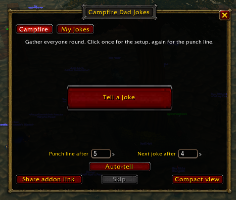
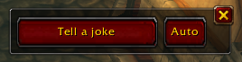

# Campfire Dad Jokes

A World of Warcraft addon (WoW: Forever, `## Interface: 16001`). Gather everyone round the fire: Campfire Dad Jokes keeps a list of dad jokes and tells them for you: as speech-style emotes everyone nearby can see ("Bo says: Why did…"), or in say, yell, party, raid, guild, a whisper or a chat channel.

## Features

- **Tell a joke:** click once for the setup, again for the punch line. No repeats until every joke has been told.
- **Where jokes go:** **Tell in:** on the Campfire tab, or `/joke to`: emote (the default), say, yell, party, raid, instance, guild, officer, a whisper or a numbered chat channel.
- **Auto-tell:** press **Auto-tell** (or `/joke auto`) and jokes keep coming until you press **Stop** (or `/joke stop`). They go where you chose when that's party, raid, instance, guild, officer or a whisper, and to your party or raid otherwise: the game only lets addons use say, yell, emotes and channels from a click. Set the pauses on the Campfire tab, **Punch line after** and **Next joke after**, or with `/joke pace <before punch line> <between jokes>` (4 s and 3 s by default, 0.5–60 s).
- **Your own jokes:** 25 starters, plus your own on the **My jokes** tab (add, edit, delete, restore the starters), or `/joke add Setup || Punch line`.
- **Compact view:** `/joke mini` leaves just the buttons on screen, movable anywhere.

## Commands

| Command | What it does |
|---------|--------------|
| `/joke` | Open the window |
| `/joke tell` | Say the next line (bind it to a key with a macro) |
| `/joke to <e\|s\|y\|p\|raid\|i\|g\|o>`, `/joke to w <name>`, `/joke to <number>` | Where jokes go (`/joke to` alone shows it) |
| `/joke auto`, `/joke stop` | Start or stop auto-tell |
| `/joke pace <punch> <next>` | Auto-tell pauses in seconds |
| `/joke mini` | Show or hide the compact view |
| `/joke skip` | Drop the joke in progress |
| `/joke share` | Say where to get the addon |
| `/joke help` | List the commands |

Nothing is sent during combat or a match: the addon says so, and you can click again afterwards.

## Install

Get it on [CurseForge](https://www.curseforge.com/wow/addons/campfire-dad-jokes), or download the zip from this repo's Releases and unzip it into `Interface/AddOns`, so you get `Interface/AddOns/DadJokes`.

## Development

This repo is published from the Gamba Forever monorepo (`addons/DadJokes/`), where the addon is tested. Pushing a `v<version>` tag here runs `.github/workflows/release.yml`: it checks the tag against `DadJokes.toc` and `CHANGELOG.md`, zips the addon, uploads it to CurseForge for game version 1.60.1 (interface 16001) with the changelog's top section as release notes, and creates a GitHub release. MIT licensed: see `LICENSE`.
